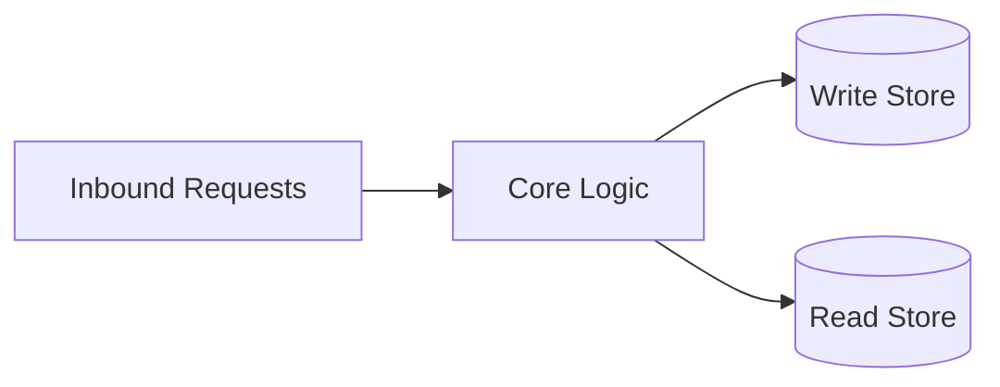
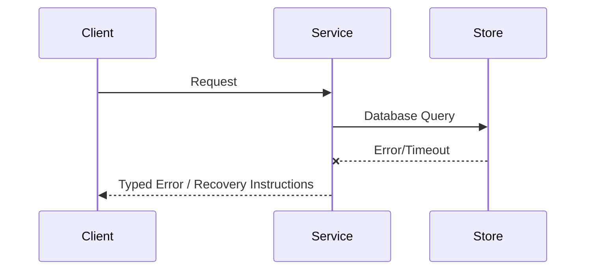

# Architecture

## Direction
Composable repository architecture with explicit boundaries and proof-backed delivery invariants.

## What This Project Is
home-manager is a service_or_library project built using shell.
Composable repository architecture with explicit boundaries and proof-backed delivery invariants.

Architectural principles:
- **Simplicity**: Keep components focused and reusable.
- **Modularity**: Clearly defined interface boundaries and dependency separation.
- **Reliability**: Graceful failure handling and thorough verification.

## Current Facts
- Runtime/languages: shell
- Detected surfaces/framework hints: shell
- Product type: service_or_library

## Architecture Map
This project's architecture consists of the following key layers/directories:
- `src/`: Main source directory containing primary logic.
- `tests/`: Integration and unit test suite.

## Data Flows
- Inbound request/command parses and validates at the entrypoint.
- Core runtime handles business logic and initiates queries or state changes.
- Storage adapter reads or writes data to the underlying persistence layers.

## Strongest Existing Primitives
- Define the strongest existing primitives in the codebase (e.g., helper utilities, base controllers, data access layers).

## Background Services on M-02877 (launchd)
Every per-user background service on the Darwin host is declared in
`modules/M-02877/darwin.nix` under `launchd.user.agents`. That module is the
single source of truth: a hand-written plist in `~/Library/LaunchAgents` is
considered drift, because it does not survive a rebuilt machine and it records
no reason for its own settings.

| Agent | Label | Program origin | Restart policy |
|---|---|---|---|
| `headroom-proxy` | `com.headroom.proxy` | Apple `container` image | `KeepAlive` |
| `headroom-watchdog` | `com.headroom.watchdog` | inline shell | `StartInterval` 60 |
| `phoenix` | `com.phoenix` | Apple `container` image | `KeepAlive` |
| `local-model-proxy` | `com.local-model-proxy` | Apple `container` image | `KeepAlive` |
| `signet-container` | `com.dktaohan.signet-container` | inline shell + AWS ECS exec | `KeepAlive` |
| `signet-team-tunnel` | `com.dktaohan.signet-team-tunnel` | Nix store (`writeShellApplication`) | `KeepAlive` |
| `signet-gateway-shim` | `com.dktaohan.signet-gateway-shim` | Nix store (`bun`) + working-tree script | `KeepAlive` |
| `pr-reviewer` | `com.dktaohan.pr-reviewer` | Nix store (`buildRustPackage`) | `KeepAlive.SuccessfulExit=false` |
| `foundry-proxy` | `com.dktaohan.foundry-proxy` | Nix store `uv` + working-tree script | `KeepAlive.SuccessfulExit=false` |
| `btsbox-devrel` | `com.lego.btsbox.devrel` | Apple python3 + `~/.local/bin` script | `KeepAlive` |
| `btsbox-devrel-serve` | `com.lego.btsbox.devrel.serve` | Nix store wrapper -> `~/.local/bin/bd` | `KeepAlive` |
| `bd-companion` | `com.gascity.bd.companion` | `Application Support` binary | `KeepAlive.SuccessfulExit=false` |

Two distinctions carry design weight:

- **Program origin is not uniform, and deliberately so.** Agents whose program
  is a Nix package point at a store path, so the closure keeps the dependency
  alive and garbage collection cannot break the agent. Agents whose program is
  installed out of band (`~/.local/bin/btsbox`, `~/.local/bin/bd`,
  `gasworks-companion` inside `Application Support`) keep absolute paths.
  Declaring those agents fixes *how they start*, not *where their programs come
  from*; pinning them into the store would mean packaging three upstreams that
  do not currently support it. What must never appear is a *literal* store path
  written out by hand, which names one build and rots at the next collection.
- **`KeepAlive = true` versus `SuccessfulExit = false`.** Unconditional restart
  suits a service whose clean exit is always a fault. Services that hold a
  single-instance lock (`pr-reviewer`'s pidfile) or that can exit deliberately
  use `SuccessfulExit = false`, so a refused start is respected instead of being
  retried forever.

## Topology
```text
Host Application -> Library API -> Domain Core -> Adapters (Store / Network)
```

## Store Boundaries


## Happy Path Sequence
```text
Client request -> API validation -> domain execution -> persistence -> response with trace id
```

## Error Path


## Execution Path
- Ingress parse + validation:
- Policy/interlock checks:
- Core execution + persistence:
- Verification and artifact emission:

## Concurrency and Runtime Model
- Execution model:
- Isolation boundaries:
- Backpressure strategy:
- Shared state synchronization:

## Deployment Topology
- Runtime units:
- Region/zone model:
- Rollout strategy (blue/green/canary):
- Rollback trigger and blast-radius scope:

## Data and Contracts
- Inbound contracts (CLI/API/events):
- Outbound dependencies (datastores/queues/external APIs):
- Data ownership boundaries:
- Schema evolution + migration policy:

## Component Responsibility Matrix
| Component/Path | Responsibility | Owns State | Calls | Must Not Do | Failure Boundary |
|---|---|---|---|---|---|
| Entrypoint | Parse, authenticate, and normalize input | Request context | Core boundary | Apply domain mutations directly | Typed input error |
| Core/domain | Enforce invariants and execute the workflow | Domain state | Interfaces and stores | Bypass policy or validation | Transaction/error result |
| Persistence adapter | Commit and retrieve canonical state | Store representation | Database/queue | Become a second source of truth | Retryable storage error |
| Verification | Produce evidence for promotion | Proof artifacts | Test/runtime surfaces | Declare success without checks | Failed/unsupported proof |

## State and Data Lifecycle
| Data/Artifact | Created By | Source of Truth | Retention | Consistency | Recovery |
|---|---|---|---|---|---|
| User/domain state | | | | | |
| Derived/read state | | | | | |
| Audit/provenance evidence | | | | | |
| Temporary execution state | | | | | |

## Failure Containment
- Invalid input is rejected before side effects.
- Policy/interlock failures leave canonical state unchanged.
- A partial persistence failure is recoverable or explicitly surfaced; it is
  never silently converted into success.
- External dependency failure has a bounded timeout, retry policy, and operator
  action.
- Evidence generation failure blocks promotion when the affected proof is
  required by [VALIDATION.md](./VALIDATION.md).

## macOS Host Configuration Boundary
The M-02877 Darwin system owns macOS applications and privileged networking
integration. Tailscale is installed as the `tailscale-app` Homebrew cask so its
GUI login, system extension, and network service remain under nix-darwin.
Home Manager owns user-space tools; Pi is sourced from the flake's
`llm-agents.packages` set. Tailscale enrollment and runtime route choices stay
manual because they are user credentials and network policy, not reproducible
package state.

## Change Propagation Checklist
- [ ] Component ownership remains singular and explicit.
- [ ] Inbound/outbound calls and data flow are still represented.
- [ ] New state has an owner, lifecycle, and migration path.
- [ ] Failure containment and rollback behavior were re-evaluated.
- [ ] Architecture and interface diagrams still describe the implementation.

## ADR Register
| ADR | Title | Status | Rationale | Date |
|---|---|---|---|---|
| ADR-001 | Initial topology choice | Proposed | Define first stable architecture | YYYY-MM-DD |

## Delivery Plan (first 3 slices)
- Slice 1 (ship first):
- Slice 2:
- Slice 3:

## Risks and Mitigations
| Risk | Likelihood | Impact | Mitigation |
|---|---|---|---|
| Contract drift across components | Medium | High | Spec + schema checks in CI |
| Runtime saturation under peak load | Medium | High | Capacity model + load tests |

<!-- decapod:codebase-attestation:start -->

## Codebase Attestation

- Repository signal fingerprint: `be0a0a0a240af03eda9eb65faaecf3abce3e08efc4a3da8bac3caa4f1dede8f4`
- Significant implementation surfaces: `.beads/` (1 files), `README.md/` (1 files), `docs/` (2 files), `terraform/` (1 files)
- Refreshed from the current codebase by `decapod specs.refresh`
<!-- decapod:codebase-attestation:end -->
