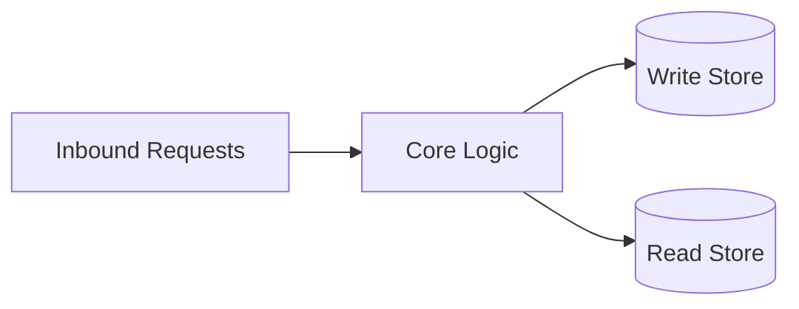
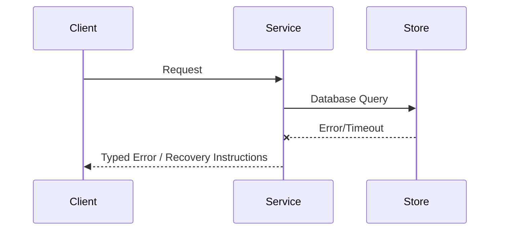

# Architecture

## Direction
Composable repository architecture with explicit boundaries and proof-backed delivery invariants.

## What This Project Is
home-manager is a service_or_library project built using shell.
Composable repository architecture with explicit boundaries and proof-backed delivery invariants.

Architectural principles:
- **Simplicity**: Keep components focused and reusable.
- **Modularity**: Clearly defined interface boundaries and dependency separation.
- **Reliability**: Graceful failure handling and thorough verification.

## Current Facts
- Runtime/languages: shell
- Detected surfaces/framework hints: shell
- Product type: service_or_library

## Architecture Map
This project's architecture consists of the following key layers/directories:
- `src/`: Main source directory containing primary logic.
- `tests/`: Integration and unit test suite.

## Data Flows
- Inbound request/command parses and validates at the entrypoint.
- Core runtime handles business logic and initiates queries or state changes.
- Storage adapter reads or writes data to the underlying persistence layers.

## Strongest Existing Primitives
- Define the strongest existing primitives in the codebase (e.g., helper utilities, base controllers, data access layers).

## Topology
```text
Host Application -> Library API -> Domain Core -> Adapters (Store / Network)
```

## Store Boundaries


## Happy Path Sequence
```text
Client request -> API validation -> domain execution -> persistence -> response with trace id
```

## Error Path


## Execution Path
- Ingress parse + validation:
- Policy/interlock checks:
- Core execution + persistence:
- Verification and artifact emission:

## Concurrency and Runtime Model
- Execution model:
- Isolation boundaries:
- Backpressure strategy:
- Shared state synchronization:

## Deployment Topology
- Runtime units:
- Region/zone model:
- Rollout strategy (blue/green/canary):
- Rollback trigger and blast-radius scope:

## Data and Contracts
- Inbound contracts (CLI/API/events):
- Outbound dependencies (datastores/queues/external APIs):
- Data ownership boundaries:
- Schema evolution + migration policy:

## Component Responsibility Matrix
| Component/Path | Responsibility | Owns State | Calls | Must Not Do | Failure Boundary |
|---|---|---|---|---|---|
| Entrypoint | Parse, authenticate, and normalize input | Request context | Core boundary | Apply domain mutations directly | Typed input error |
| Core/domain | Enforce invariants and execute the workflow | Domain state | Interfaces and stores | Bypass policy or validation | Transaction/error result |
| Persistence adapter | Commit and retrieve canonical state | Store representation | Database/queue | Become a second source of truth | Retryable storage error |
| Verification | Produce evidence for promotion | Proof artifacts | Test/runtime surfaces | Declare success without checks | Failed/unsupported proof |

## State and Data Lifecycle
| Data/Artifact | Created By | Source of Truth | Retention | Consistency | Recovery |
|---|---|---|---|---|---|
| User/domain state | | | | | |
| Derived/read state | | | | | |
| Audit/provenance evidence | | | | | |
| Temporary execution state | | | | | |

## Failure Containment
- Invalid input is rejected before side effects.
- Policy/interlock failures leave canonical state unchanged.
- A partial persistence failure is recoverable or explicitly surfaced; it is
  never silently converted into success.
- External dependency failure has a bounded timeout, retry policy, and operator
  action.
- Evidence generation failure blocks promotion when the affected proof is
  required by [VALIDATION.md](./VALIDATION.md).

## macOS Host Configuration Boundary
The M-02877 Darwin system owns macOS applications and privileged networking
integration. Tailscale is installed as the `tailscale-app` Homebrew cask so its
GUI login, system extension, and network service remain under nix-darwin.
Home Manager owns user-space tools; Pi is sourced from the flake's
`llm-agents.packages` set. Tailscale enrollment and runtime route choices stay
manual because they are user credentials and network policy, not reproducible
package state.

### Homebrew Cask Upgrade Guard
Activation's `brew bundle` upgrades casks, including self-updating ones. The
self-updaters of apps in `/Applications` (ShipIt, Sparkle, JetBrains Toolbox)
can leave root-owned files. This user may not run `sudo`, so Homebrew then can't
move the app aside, and the failed upgrade can delete part of the bundle first.
`just deploy-darwin` therefore runs `scripts/cask-app-preflight.sh` before
`darwin-rebuild`. It moves leftover Caskroom backups of failed upgrades to the
Trash, and stops the deploy if a casked app, in the appdir Homebrew recorded for
that cask, has files not owned by the user,
printing one `osascript` admin command that changes ownership only.
`/etc/homebrew/brew.env` (`modules/M-02877/homebrew-env.nix`) turns off Homebrew's
env hints and the sudo service-domain warning. It is the only place those
settings reach activation's `brew bundle`, which runs through
`sudo --preserve-env=PATH`.
Copies outside the recorded appdir are ignored: the Jamf device management on
M-02877 installs its own SIP-protected `/Applications/Claude.app`, which even root
cannot `chown`, alongside the Homebrew `claude` cask in `~/Applications`.

## Change Propagation Checklist
- [ ] Component ownership remains singular and explicit.
- [ ] Inbound/outbound calls and data flow are still represented.
- [ ] New state has an owner, lifecycle, and migration path.
- [ ] Failure containment and rollback behavior were re-evaluated.
- [ ] Architecture and interface diagrams still describe the implementation.

## ADR Register
| ADR | Title | Status | Rationale | Date |
|---|---|---|---|---|
| ADR-001 | Initial topology choice | Proposed | Define first stable architecture | YYYY-MM-DD |

## Delivery Plan (first 3 slices)
- Slice 1 (ship first):
- Slice 2:
- Slice 3:

## Risks and Mitigations
| Risk | Likelihood | Impact | Mitigation |
|---|---|---|---|
| Contract drift across components | Medium | High | Spec + schema checks in CI |
| Runtime saturation under peak load | Medium | High | Capacity model + load tests |

## Doom Emacs Configuration Flow
`modules/doom.d/init.el` declares Doom's enabled modules, including `:ui zen`.
Home Manager's `modules/doom-emacs.nix` copies that directory into the managed
Doom profile, so the checked-in Doom files remain the user-editable source of
truth. `modules/doom.d/config.el` sets `evil-escape` to use `jk` and fixes
Writeroom's centered text area at 80 columns. At runtime, Doom's `SPC t z`
command toggles the focused layout for the current buffer; `SPC t Z` also
full-screens the Emacs frame. Doom supplies Writeroom through its Zen module,
so this workflow does not add a separately managed Olivetti package.

## Secret Resolution Flow
`secretspec.toml` names every secret and routes all of them through the
`personal` provider alias, then the keyring. Home Manager
(`modules/shared-devtools.nix`) writes `~/.config/secretspec/config.toml` to
define `personal` for each host. On M-02877 it is `age://secretspec.age`,
committed next to the manifest and encrypted to the two post-quantum recipients
in `secretspec.age.recipients`: the Mac's Secure Enclave key and a backup key.
secretspec decrypts with the Secure Enclave identity at
`~/.config/secretspec/se-identity.txt` through `age-plugin-se`. That path
involves no Keychain item, so the per-build cdhash trust that caused a dialog
on every secretspec rebuild (cachix/secretspec#438) no longer applies. On
Linux hosts `personal` is the keyring. Writes re-encrypt to both recipients.
The `modules/overlays.nix` wrapper adds `age-plugin-pq` (nixpkgs) and
Homebrew's `age-plugin-se` to secretspec's PATH. Homebrew provides the plugin
because only its Xcode-built bottle supports post-quantum Secure Enclave keys.

<!-- decapod:codebase-attestation:start -->

## Codebase Attestation

- Repository signal fingerprint: `ffee50b413844cc1e3e37983172e16ba68d172c404fcc7495b65983cf5027faf`
- Significant implementation surfaces: `.beads/` (1 files), `.github/` (1 files), `README.md/` (1 files), `docs/` (2 files), `terraform/` (1 files)
- Refreshed from the current codebase by `decapod specs.refresh`
<!-- decapod:codebase-attestation:end -->
