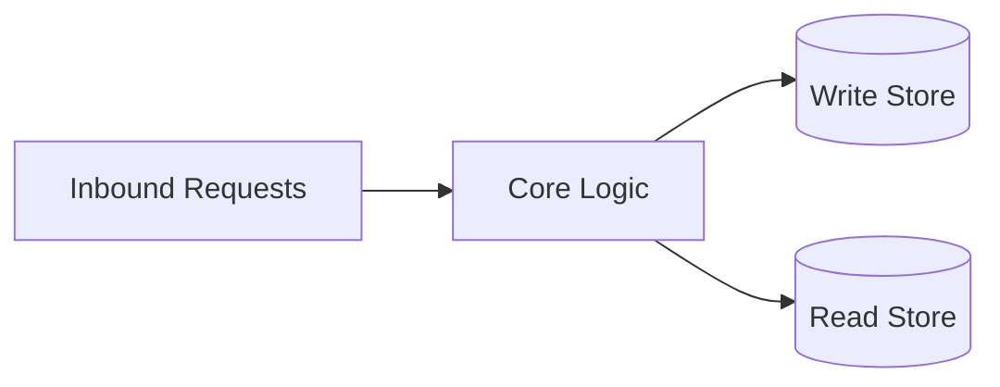
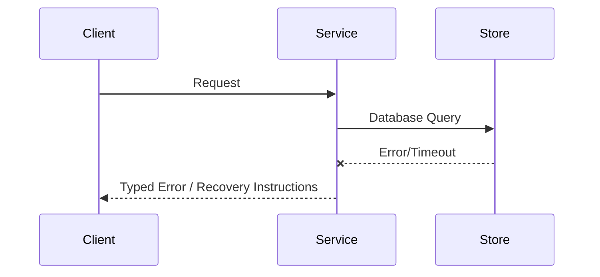

# Architecture

## Direction
Composable repository architecture with explicit boundaries and proof-backed delivery invariants.

## What This Project Is
home-manager is a service_or_library project built using shell.
Composable repository architecture with explicit boundaries and proof-backed delivery invariants.

Architectural principles:
- **Simplicity**: Keep components focused and reusable.
- **Modularity**: Clearly defined interface boundaries and dependency separation.
- **Reliability**: Graceful failure handling and thorough verification.

## Current Facts
- Runtime/languages: shell
- Detected surfaces/framework hints: shell
- Product type: service_or_library

## Architecture Map
This project's architecture consists of the following key layers/directories:
- `src/`: Main source directory containing primary logic.
- `tests/`: Integration and unit test suite.

## Data Flows
- Inbound request/command parses and validates at the entrypoint.
- Core runtime handles business logic and initiates queries or state changes.
- Storage adapter reads or writes data to the underlying persistence layers.

## Strongest Existing Primitives
- Define the strongest existing primitives in the codebase (e.g., helper utilities, base controllers, data access layers).

## Topology
```text
Host Application -> Library API -> Domain Core -> Adapters (Store / Network)
```

## Store Boundaries

```mermaid
flowchart LR
  I[Inbound Requests] --> C[Core Logic]
  C --> W[(Write Store)]
  C --> R[(Read Store)]
```

## Happy Path Sequence
```text
Client request -> API validation -> domain execution -> persistence -> response with trace id
```

## Error Path

```mermaid
sequenceDiagram
  participant Client
  participant Service
  participant Store
  Client->>Service: Request
  Service->>Store: Database Query
  Store--xService: Error/Timeout
  Service-->>Client: Typed Error / Recovery Instructions
```

## Execution Path
- Ingress parse + validation:
- Policy/interlock checks:
- Core execution + persistence:
- Verification and artifact emission:

## Concurrency and Runtime Model
- Execution model:
- Isolation boundaries:
- Backpressure strategy:
- Shared state synchronization:

## Deployment Topology
- Runtime units:
- Region/zone model:
- Rollout strategy (blue/green/canary):
- Rollback trigger and blast-radius scope:

## Mahakala Guix Deployment
`just deploy-mahakala` pulls the system and user Guix channels, applies Guix System and Guix Home, updates flake inputs, and switches Home Manager.

The system configuration is `guix/system.scm`. The home configuration is `guix/home-configuration.scm`. System deploy and kernel recipes use `justfile_directory()` so an isolated worktree supplies its own source files.

The QCA6174 card uses `ath10k_pci`. The Guix System kernel arguments request `ath10k_pci.reset_mode=1`. The built module defines `0` as automatic reset and `1` as warm-only reset.

This reset mode is a recovery trial, not a proven fix. The deployment does not force a reboot. The next planned boot must confirm the ath10k probe result.

## Data and Contracts
- Inbound contracts (CLI/API/events):
- Outbound dependencies (datastores/queues/external APIs):
- Data ownership boundaries:
- Schema evolution + migration policy:

## Component Responsibility Matrix
| Component/Path | Responsibility | Owns State | Calls | Must Not Do | Failure Boundary |
|---|---|---|---|---|---|
| Entrypoint | Parse, authenticate, and normalize input | Request context | Core boundary | Apply domain mutations directly | Typed input error |
| Core/domain | Enforce invariants and execute the workflow | Domain state | Interfaces and stores | Bypass policy or validation | Transaction/error result |
| Persistence adapter | Commit and retrieve canonical state | Store representation | Database/queue | Become a second source of truth | Retryable storage error |
| Verification | Produce evidence for promotion | Proof artifacts | Test/runtime surfaces | Declare success without checks | Failed/unsupported proof |

## State and Data Lifecycle
| Data/Artifact | Created By | Source of Truth | Retention | Consistency | Recovery |
|---|---|---|---|---|---|
| User/domain state | | | | | |
| Derived/read state | | | | | |
| Audit/provenance evidence | | | | | |
| Temporary execution state | | | | | |

## Failure Containment
- Invalid input is rejected before side effects.
- Policy/interlock failures leave canonical state unchanged.
- A partial persistence failure is recoverable or explicitly surfaced; it is
  never silently converted into success.
- External dependency failure has a bounded timeout, retry policy, and operator
  action.
- Evidence generation failure blocks promotion when the affected proof is
  required by [VALIDATION.md](./VALIDATION.md).

## macOS Host Configuration Boundary
The M-02877 Darwin system owns macOS applications and privileged networking
integration. Tailscale is installed as the `tailscale-app` Homebrew cask so its
GUI login, system extension, and network service remain under nix-darwin.
Home Manager owns user-space tools; Pi is sourced from the flake's
`llm-agents.packages` set. Tailscale enrollment and runtime route choices stay
manual because they are user credentials and network policy, not reproducible
package state.

### Durable App Signing Identity on M-02877
macOS privacy grants (App Management, Full Disk Access) for Home Manager's
WezTerm are pinned to its designated requirement: bundle identifier plus the
leaf certificate `scripts/hm-app-signing.sh` signs with. The identity
(certificate and key, PKCS#12 encrypted with `HM_APP_SIGNING_KEYCHAIN_PASSWORD`)
is escrowed as `HM_APP_SIGNING_IDENTITY` in `secretspec.age`, so the
`hm-app-signing` keychain is a cache: `sign`, which runs on every activation,
rebuilds it from the escrow whenever it is missing, will not open with the
stored password, or holds another identity, and signs with the same
certificate. A grant made once therefore survives rebuilds and keychain loss;
only `hm-app-signing setup` without an escrow mints a new identity. The escrow
shares `secretspec.age`'s recovery path (the post-quantum backup key).
`just deploy-darwin` ends by printing `hm-app-signing status`.

### Temporary Lix Link-Flag Override on M-02877
nixpkgs 97bf56b78d set `NIX_LDFLAGS = "-z,noexecstack"` on Lix for every
platform; Apple's ld rejects `-z`, so Lix 2.95.3 and the whole darwin system
failed to build. `modules/M-02877/darwin.nix` clears the flag on Darwin through
`lixPackageSets.latest.overrideScope`, keyed on the flag's presence so it turns
into a no-op once upstream restricts the flag to Linux. Until then Lix builds
locally on M-02877 (about 20 minutes including its test suite).

### Gateway Key Lookup Retries
`gateway.keyCommand` tries `secretspec get` up to six times, sleeping 0.5, 1,
1, 1.5 and 2 seconds between attempts (6 s of backoff inside pi's 10 s
per-request budget). A secretspec age lookup must start `age-plugin-se`, and
under heavy CPU load the Secure Enclave call fails instantly with "No matching
keys found": twice on 2026-09-29 at the tail of heavy builds, and repeatedly on
2026-10-01 at a load average of ~16 from an emulated container build, when the
earlier three attempts one second apart all missed. pi resolves the key per
request and turns each miss into a failed turn. Lowering the load (for example
`renice` on the podman VM) is the immediate remedy; the backoff makes a short
stall survivable. Earlier attempts append their error text to
`~/.local/state/secretspec-gateway.log` so the next miss records its cause;
stderr-capturing callers see one error.

### Unattended topgrade on M-02877
topgrade must finish without input. Steps that would ask for a password or
duplicate a managed updater are disabled in `modules/M-02877/dktaohan.nix`:
`system` (macOS `softwareupdate` needs an admin password; Jamf and Nudge own
OS updates), `microsoft_office` (Intune-managed AutoUpdate), and the VS Code,
Insiders and Cursor extension steps (the editors self-update).

### Tailnet Name Resolution on M-02877
"Use Tailscale DNS" stays off on M-02877 because the tailnet pushes global
resolvers that would displace LAN and corporate DNS. MagicDNS names still
resolve: nix-darwin writes `/etc/resolver/hound-celsius.ts.net` pointing at
tailscaled's `100.100.100.100`, which macOS consults for that domain only. The
fleet SSH aliases in `modules/ssh.nix` (now including `mahakala`) depend on it.

### Homebrew Cask Upgrade Guard
Activation's `brew bundle` upgrades casks, including self-updating ones. The
self-updaters of apps in `/Applications` (ShipIt, Sparkle, JetBrains Toolbox)
can leave root-owned files. This user has `sudo` only while SAP Privileges
grants admin, so Homebrew then can't move the app aside, and the failed upgrade
can delete part of the bundle first.
`just deploy-darwin` therefore runs `scripts/cask-app-preflight.sh` before
`darwin-rebuild`. It moves leftover Caskroom backups of failed upgrades to the
Trash, and stops the deploy if a casked app, in the appdir Homebrew recorded for
that cask, has files not owned by the user,
printing one `osascript` admin command that changes ownership only.
SAP Privileges (Jamf-managed) makes the user an admin for 10 minutes at a time
and revokes it on screen lock, so `/Applications` (root:admin, 775) is writable
only intermittently, and a deploy outlasts a grant. Casks recorded there are
upgraded after the grant lapses: the bundle is emptied, the directory cannot be
removed, `sudo` is refused, and an empty app remains. For each cask whose
recorded appdir is not owned by the user (ownership, not momentary
writability, decides) and that is outdated (`brew outdated --cask --greedy`, after a
`brew update`) or already an empty shell, the preflight parks its Caskroom
record and reinstalls it into `~/Applications`, the configured
`homebrew.caskArgs.appdir`, parking and restoring the cask's CLI symlinks
around the install. The old copy goes to the Trash when the appdir is writable
at that moment; otherwise it is left intact and an optional admin `rm -rf` is
printed. If the reinstall fails, the record and symlinks are restored and the
deploy stops. Each cask migrates once, so the check retires itself.

### Flake Update Cost on M-02877
Microsoft Defender inspects every file open by `nix` and `nix-daemon` on
M-02877 (about 3.5 ms per file; `cat`, which is on its exclusion list, reads the
same 54k-file nixpkgs tree 12x faster). Fetching one nixpkgs revision took 8.5
minutes. The repository therefore minimises trees Nix must touch there:
topgrade's "Flake inputs" step runs `just update-darwin`, which skips the
Linux-only root inputs in `darwin-skip-inputs` (nixarchy brings a third nixpkgs
and ~15 inputs); one root `rust-overlay` is followed by decapod, devenv and
emacs-tramp-rpc; and `just cachix-push /run/current-system` pushes the path
darwin-rebuild just built instead of evaluating the system again. The durable
fix is a Defender exclusion for Lix's `nix`/`nix-daemon` or `/nix/store`, which
only device management can grant.

### No Keychain Dialogs on M-02877
Unattended work must not raise keychain password dialogs. Two sources did, both
because a keychain item's ACL trusted one exact build of a binary Nix or
Homebrew rebuilds. secretspec on M-02877 reads only `secretspec.age` (no
`keyring` fallback in `secretspec.toml`), and Homebrew's GitHub API token comes
from `gh auth token` (gh reaches the keychain through Apple's stable
`/usr/bin/security`). Apple container's `ghcr.io` credential, read on every
headroom and local-model-proxy start, is gh's token stored by `just
ghcr-login` with an any-app ACL. The accepted trade-off matches the age store:
any process running as the user can read these without a dialog.

### Binary Cache Declarations
`flake.nix` carries no `nixConfig`: a declined flake config warns on every nix
command. M-02877 declares its caches in `modules/M-02877/darwin.nix`;
mahakala's Home Manager switch passes the numtide, nixarchy and Hyprland caches
with their keys through `NIX_CONFIG` in `deploy-mahakala-hm-only`. `pkg` casks are out of scope; they need an admin installer.
`/etc/homebrew/brew.env` (`modules/M-02877/homebrew-env.nix`) turns off Homebrew's
env hints and the sudo service-domain warning. It is the only place those
settings reach activation's `brew bundle`, which runs through
`sudo --preserve-env=PATH`.
Copies outside the recorded appdir are ignored: the Jamf device management on
M-02877 installs its own SIP-protected `/Applications/Claude.app`, which even root
cannot `chown`, alongside the Homebrew `claude` cask in `~/Applications`.

## Change Propagation Checklist
- [ ] Component ownership remains singular and explicit.
- [ ] Inbound/outbound calls and data flow are still represented.
- [ ] New state has an owner, lifecycle, and migration path.
- [ ] Failure containment and rollback behavior were re-evaluated.
- [ ] Architecture and interface diagrams still describe the implementation.

## ADR Register
| ADR | Title | Status | Rationale | Date |
|---|---|---|---|---|
| ADR-001 | Initial topology choice | Proposed | Define first stable architecture | YYYY-MM-DD |

## Delivery Plan (first 3 slices)
- Slice 1 (ship first):
- Slice 2:
- Slice 3:

## Risks and Mitigations
| Risk | Likelihood | Impact | Mitigation |
|---|---|---|---|
| Contract drift across components | Medium | High | Spec + schema checks in CI |
| Runtime saturation under peak load | Medium | High | Capacity model + load tests |

## Doom Emacs Configuration Flow
`modules/doom.d/init.el` declares Doom's enabled modules, including `:ui zen`.
Home Manager's `modules/doom-emacs.nix` copies that directory into the managed
Doom profile, so the checked-in Doom files remain the user-editable source of
truth. `modules/doom.d/config.el` sets `evil-escape` to use `jk` and fixes
Writeroom's centered text area at 80 columns. At runtime, Doom's `SPC t z`
command toggles the focused layout for the current buffer; `SPC t Z` also
full-screens the Emacs frame. Doom supplies Writeroom through its Zen module,
so this workflow does not add a separately managed Olivetti package.

## Secret Resolution Flow
`secretspec.toml` names every secret and routes all of them through the
`personal` provider alias, then the keyring. Home Manager
(`modules/shared-devtools.nix`) writes `~/.config/secretspec/config.toml` to
define `personal` for each host. On M-02877 it is `age://secretspec.age`,
committed next to the manifest and encrypted to the two post-quantum recipients
in `secretspec.age.recipients`: the Mac's Secure Enclave key and a backup key.
secretspec decrypts with the Secure Enclave identity at
`~/.config/secretspec/se-identity.txt` through `age-plugin-se`. That path
involves no Keychain item, so the per-build cdhash trust that caused a dialog
on every secretspec rebuild (cachix/secretspec#438) no longer applies. On
Linux hosts `personal` is the keyring. Writes re-encrypt to both recipients.
The `modules/overlays.nix` wrapper adds `age-plugin-pq` (nixpkgs) and
Homebrew's `age-plugin-se` to secretspec's PATH. Homebrew provides the plugin
because only its Xcode-built bottle supports post-quantum Secure Enclave keys.

<!-- decapod:codebase-attestation:start -->

## Codebase Attestation

- Repository signal fingerprint: `0e05719cad3ab88e6d446097561a1ff22afe40a70b25362f791f6f983727d72e`
- Significant implementation surfaces: `.beads/` (1 files), `.github/` (1 files), `README.md/` (1 files), `docs/` (2 files), `terraform/` (1 files)
- Refreshed from the current codebase by `decapod specs.refresh`
<!-- decapod:codebase-attestation:end -->
