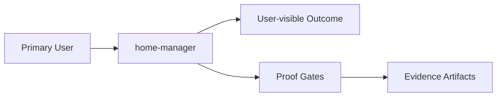

# Intent

<!-- decapod:declared-capabilities:start -->

## Declared Capability Surfaces

- `infrastructure-management`
- `secrets-handling`

<!-- decapod:declared-capabilities:end -->

## Product Outcome
- To quickly bring up my Home Manager config first install Nix then
- In Doom Emacs, type `jk` to leave Evil insert state. Toggle `SPC t z` for a centered 80-column writing area, or `SPC t Z` to use the same focused layout while full-screening the Emacs frame.

## What This Project Is
home-manager is a service_or_library project built using shell.
To quickly bring up my Home Manager config first install Nix then

Key operating facts:
- **Primary languages**: shell
- **Detected surfaces**: shell

## Product View

## Inferred Baseline
- Repository: home-manager
- Product type: service_or_library
- Primary languages: shell
- Detected surfaces: shell

## Scope
| Area | In Scope | Proof Surface |
|---|---|---|
| Core workflow | Define a concrete user-visible workflow | Acceptance criteria + tests |
| Data contracts | Document canonical inputs/outputs | [INTERFACES.md](./INTERFACES.md) and schema checks |
| Delivery quality | Block promotion on broken proof surfaces | [VALIDATION.md](./VALIDATION.md) blocking gates |

## Non-Goals (Falsifiable)
| Non-goal | How to falsify |
|---|---|
| Feature creep beyond the primary outcome | Any PR adds capability not tied to outcome criteria |
| Shipping without evidence | Missing validation artifacts for promoted changes |
| Ambiguous ownership boundaries | Missing owner/system-of-record in interfaces |

## Constraints
- Technical: runtime, dependency, and topology boundaries are explicit.
- Operational: deployment, rollback, and incident ownership are defined.
- Security/compliance: sensitive data handling and authz are mandatory.

## Acceptance Criteria (must be objectively testable)
- [ ] Decapod validate passes, required tests pass, and promotion-relevant artifacts are present.
- [ ] The Home Manager managed Doom config enables `:ui zen`, sets its writing width to 80 columns, and configures Evil escape as `jk`.
- [ ] Doom's buffer and full-screen Zen toggles keep writing text centered at the configured width and can be toggled off.
- [ ] Non-functional targets are met (latency, reliability, cost, etc.).
- [ ] Validation gates pass and artifacts are attached.
- [ ] Repository test/lint/typecheck commands are defined and wired into CI.

## Epistemic Custody Fields

### Active Assumptions
- [ ] List any assumptions made to proceed.
- [ ] Flag assumptions that require future verification.

### Confidence & Risk Level
- **Confidence**: Low/Medium/High (Rationale: )
- **Risk**: Low/Medium/High (Impact of wrong assumptions: )

### Measured vs Inferred Facts
| Fact | Source (Provenance) | Type (Measured/Inferred) |
|---|---|---|
| | | |

### Unresolved Contradictions
- [ ] List any evidence that conflicts with current assumptions or intent.

### Deferred Questions
- [ ] Questions to be answered later.

### Stop Conditions
- [ ] Explicit conditions under which the agent should stop and ask for help.

### Proof Required Before Completion
- [ ] Specific evidence needed to prove the outcome is met.

## Tradeoffs Register
| Decision | Benefit | Cost | Review Trigger |
|---|---|---|---|
| Simplicity vs extensibility | Faster iteration | Potential rework | Feature set expands |
| Strict gates vs dev speed | Higher confidence | More upfront discipline | Lead time regressions |

## Secret Prompt Budget (M-02877)
Reading secretspec secrets on M-02877 raises no dialog, even after a
secretspec rebuild. The committed store must stay confidential in a public
repository against later cryptanalysis, so every recipient is post-quantum.
The decryption key must not be exportable from the machine. The user accepts
that any process running as them on that Mac can decrypt without a dialog.
A backup key held only in a password manager is the recovery path.

## Deploys Must Not Damage Apps
A failed Homebrew cask upgrade during `just deploy-darwin` must stop before it
can touch the app. It must not leave an app half-deleted, as happened to
ChatGPT.app. Fixes that need admin rights are one command the user runs, and
they change ownership only.

## First Implementation Slice
- [ ] Define the smallest user-visible workflow to ship first.
- [ ] Define required data/contracts for that workflow.
- [ ] Define what is intentionally postponed until v2.

## User and Actor Contract
- Primary user/agent:
- Authorized actors and their allowed mutations:
- Preconditions required before the primary workflow:
- Observable success result:
- Observable failure result and recovery action:
- Human decision points that automation must not infer:

## Outcome Decomposition
| Outcome | Trigger | State Written | Evidence | Owner |
|---|---|---|---|---|
| Primary outcome | | | | |
| Safety/quality outcome | | | | |
| Operational outcome | | | | |

## Change Impact Rules
- A change to user intent updates this document and acceptance criteria.
- A change to a runtime boundary updates [ARCHITECTURE.md](./ARCHITECTURE.md).
- A change to a callable or persisted contract updates [INTERFACES.md](./INTERFACES.md).
- A change to proof or promotion behavior updates [VALIDATION.md](./VALIDATION.md).
- A breaking change requires an explicit migration trigger, compatibility note,
  rollback condition, and an agent-facing instruction.

## Open Questions (with decision deadlines)
| Question | Owner | Deadline | Decision |
|---|---|---|---|
| Which interfaces are versioned at launch? | TBD | YYYY-MM-DD | |
| Which non-functional target is hardest to hit? | TBD | YYYY-MM-DD | |

<!-- decapod:codebase-attestation:start -->

## Codebase Attestation

- Repository signal fingerprint: `ffee50b413844cc1e3e37983172e16ba68d172c404fcc7495b65983cf5027faf`
- Significant implementation surfaces: `.beads/` (1 files), `.github/` (1 files), `README.md/` (1 files), `docs/` (2 files), `terraform/` (1 files)
- Refreshed from the current codebase by `decapod specs.refresh`
<!-- decapod:codebase-attestation:end -->
