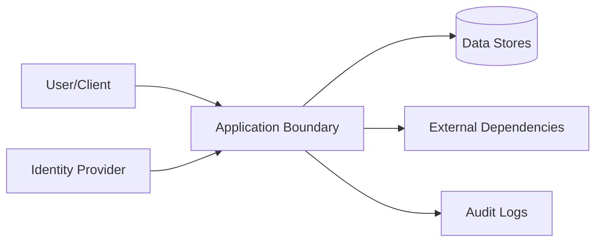

# Security

## Threat Model

## STRIDE Table
| Threat | Surface | Mitigation | Verification |
|---|---|---|---|
| Spoofing | Auth boundary | strong auth + token validation | auth tests |
| Tampering | State mutation APIs | integrity checks + RBAC | integration tests |
| Repudiation | Critical actions | immutable audit logs | log review |
| Information disclosure | Data at rest/in transit | encryption + classification | security scans |
| Denial of service | Hot paths | rate limit + backpressure | load tests |
| Elevation of privilege | Admin interfaces | least privilege + policy checks | authz tests |

## Authentication
- Identity source:
- Token/session lifetime:
- Rotation and revocation:

## Authorization
- Role model:
- Resource-level policy:
- Privilege escalation controls:

## Data Classification
| Data Class | Examples | Storage Rules | Access Rules |
|---|---|---|---|
| Public | docs, non-sensitive metadata | standard | unrestricted |
| Internal | operational telemetry | controlled | team access |
| Sensitive | tokens, PII, secrets | encrypted | least privilege |

## Sensitive Data Handling
- Encryption at rest:
- Encryption in transit:
- Redaction in logs:
- Retention + deletion policy:

## Supply Chain Security
- Recommended scanners: `npm audit`, `osv-scanner`, `snyk`
- Dependency update cadence:
- Signed artifact/provenance strategy:

## Secrets Management
| Secret | Source | Rotation | Consumer |
|---|---|---|---|
| `LEGO_GATEWAY_API_KEY` | `secretspec` provider, named (not stored) in `gateway.json` | provider-managed | every CLI coding agent, Emacs agent-shell, headroom |
| External service auth material | managed runtime configuration | periodic | runtime services |
| Artifact signing material | managed signing service/local secure store | periodic | release pipeline |

### Credential Handling Invariant
No secret value may enter a tracked file or the Nix store. Only the *name* of a
secret and a *command* that prints it may be declared; the value exists solely
in the environment of a process about to spend it.

This forces a documented departure from vendor setup instructions. The gateway's
own docs configure Claude Code with `ANTHROPIC_AUTH_TOKEN=<credential>`, which
suits a human exporting into their own shell but would place the value in a
world-readable store path under `home.sessionVariables` or a shell profile. The
wrapper in `modules/agent-providers.nix` therefore runs the lookup at process
start instead. Shell init is not sufficient on mahakala: Home Manager does not
own the shell there (Guix Home does, and its `bashrc` returns early for
non-interactive shells), so an export would miss agents spawned by Emacs or a
timer.

Proof obligation: after any change to credential plumbing, grep the live secret
value against the built closure and confirm zero matches. Done for `b9d6b00`.
A prior violation of this invariant -- a `vk_...` key pasted into an untracked
`~/.cave/agent/models.json` -- is recorded as `home-manager-l23`; note that it
persisted precisely because the file was unmanaged, so no deploy could correct it.

## Security Testing
| Test Type | Cadence | Tooling |
|---|---|---|
| SAST | each PR | language linters/scanners |
| Dependency scan | each PR + weekly | supply-chain tools |
| DAST/pentest | scheduled | external/internal |

## Trust-Boundary Inventory
| Boundary | Principal/Input | Authority Granted | Validation | Audit Evidence | Failure Default |
|---|---|---|---|---|---|
| User/agent -> entrypoint | | | | | deny/reject |
| Entrypoint -> core | | | | | deny/reject |
| Core -> persistence | | | | | fail closed/transaction rollback |
| Runtime -> external dependency | | | | | timeout/degrade |

## Agent and Automation Safety
- Prompt/configuration text is treated as untrusted input until evaluated by
  the repository's policy gate.
- Automation must not infer authorization, ownership, or a migration approval
  that is not present in the governed context.
- Sensitive artifacts, credentials, and untrusted attachments are not executed
  or imported as instructions.
- Every privileged mutation has an actor, scope, and durable evidence trail.

## Security Change Review
- [ ] New inputs and outputs are classified.
- [ ] Trust boundaries and privilege changes are documented.
- [ ] Abuse cases cover spoofing, tampering, disclosure, denial of service, and
  privilege escalation as applicable.
- [ ] Secret handling, redaction, retention, and deletion were re-checked.
- [ ] Supply-chain and provenance implications are recorded.

## Compliance and Audit
- Regulatory scope:
- Audit evidence location:
- Exception process:

## Pre-Promotion Security Checklist
- [ ] Threat model updated for changed surfaces.
- [ ] Auth/authz tests pass.
- [ ] Dependency vulnerability scan reviewed.
- [ ] No unresolved critical/high security findings.

## Strongest Security Primitives
Describe the security primitives and security controls implemented in this repository.

## Security Practices
- **Least Privilege**: Ensure minimal access permissions for all subsystems and roles.
- **Input Validation**: Strictly validate all inputs at trust boundaries.
- **Secure Storage**: Encrypt sensitive data at rest and in transit.

<!-- decapod:codebase-attestation:start -->

## Codebase Attestation

- Repository signal fingerprint: `199dfd5b776c22e7446b4aeb365195a491af7505d2a4493bb7e9d85d636169aa`
- Significant implementation surfaces: `.beads/` (1 files), `.github/` (1 files), `README.md/` (1 files), `docs/` (2 files), `terraform/` (1 files)
- Refreshed from the current codebase by `decapod specs.refresh`
<!-- decapod:codebase-attestation:end -->
