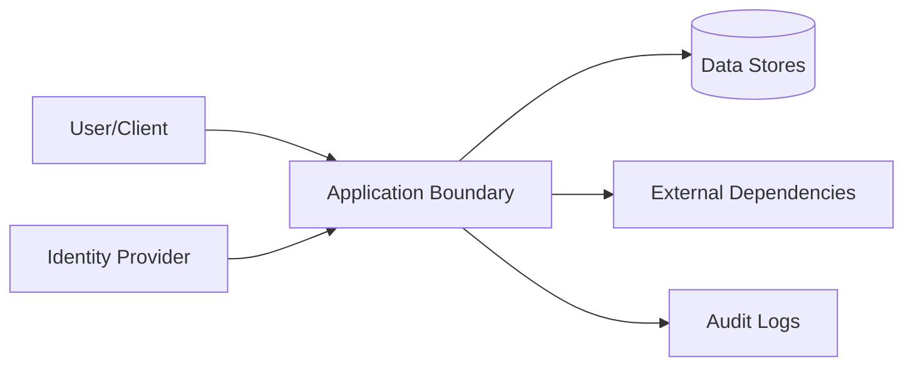

# Security

## Threat Model

## STRIDE Table
| Threat | Surface | Mitigation | Verification |
|---|---|---|---|
| Spoofing | Auth boundary | strong auth + token validation | auth tests |
| Tampering | State mutation APIs | integrity checks + RBAC | integration tests |
| Repudiation | Critical actions | immutable audit logs | log review |
| Information disclosure | Data at rest/in transit | encryption + classification | security scans |
| Denial of service | Hot paths | rate limit + backpressure | load tests |
| Elevation of privilege | Admin interfaces | least privilege + policy checks | authz tests |

## Authentication
- Identity source:
- Token/session lifetime:
- Rotation and revocation:

## Authorization
- Role model:
- Resource-level policy:
- Privilege escalation controls:

## Data Classification
| Data Class | Examples | Storage Rules | Access Rules |
|---|---|---|---|
| Public | docs, non-sensitive metadata | standard | unrestricted |
| Internal | operational telemetry | controlled | team access |
| Sensitive | tokens, PII, secrets | encrypted | least privilege |

## Sensitive Data Handling
- Encryption at rest:
- Encryption in transit:
- Redaction in logs:
- Retention + deletion policy:

## Supply Chain Security
- Recommended scanners: `npm audit`, `osv-scanner`, `snyk`
- Dependency update cadence:
- Signed artifact/provenance strategy:

## Secrets Management
| Secret | Source | Rotation | Consumer |
|---|---|---|---|
| External service auth material | managed runtime configuration | periodic | runtime services |
| Artifact signing material | managed signing service/local secure store | periodic | release pipeline |
| `LEGO_GATEWAY_API_KEY`, `HOMEBREW_GITHUB_API_TOKEN`, `CACHIX_AUTH_TOKEN`, `CHORUS_API_KEY` | `secretspec.toml` profile | periodic | gateway/provider config, nix-darwin activation, cache push |
| `LEGO_GENAI_TOKEN` | Signet portable store, decrypted at call time by `signet-read-lego-secret` | periodic | `signet-gateway-shim` LaunchAgent |
| BTS devrel box token | `~/.config/bts-box/boxes/devrel/gateway.token` (0600), read at startup by the `btsbox-devrel-serve` wrapper | box re-issue | `btsbox-devrel-serve` LaunchAgent |
| `pr-reviewer` GitHub token | encrypted in `~/Library/Application Support/pr-reviewer/config.toml` with a sibling keyfile | manual | `pr-reviewer` daemon |

### Invariant: no secret may enter a launchd service definition
Every string in `modules/**` is committed to git and materialises
world-readable in `/nix/store`. A credential written into a
`launchd.user.agents.*.serviceConfig.EnvironmentVariables` value is therefore
published twice over, and `chmod` on the generated plist cannot retract it.

An agent that needs a credential must instead receive a *reference* that is
resolved at startup or per call:

- a command that decrypts on demand and returns the value over a private pipe
  (`signet-read-lego-secret`, consumed via `SHIM_TOKEN_COMMAND`);
- a wrapper generated by `writeShellApplication` that reads an owner-only file
  into the environment immediately before `exec`
  (`btsbox-devrel-serve`), failing loudly when the file is absent rather than
  starting a service that will reject every authenticated request;
- a file path passed to the program, where the program supports it
  (`bd serve --auth-token-file`, `gasworks-companion -token-file`).

When a hand-written plist carrying an inline credential is migrated into this
repository, the credential is the migration's primary hazard: reproduce the
*behaviour* by reference and confirm the derived value matches the original
byte-for-byte, rather than copying the literal across.

## Security Testing
| Test Type | Cadence | Tooling |
|---|---|---|
| SAST | each PR | language linters/scanners |
| Dependency scan | each PR + weekly | supply-chain tools |
| DAST/pentest | scheduled | external/internal |

## Trust-Boundary Inventory
| Boundary | Principal/Input | Authority Granted | Validation | Audit Evidence | Failure Default |
|---|---|---|---|---|---|
| User/agent -> entrypoint | | | | | deny/reject |
| Entrypoint -> core | | | | | deny/reject |
| Core -> persistence | | | | | fail closed/transaction rollback |
| Runtime -> external dependency | | | | | timeout/degrade |

## Agent and Automation Safety
- Prompt/configuration text is treated as untrusted input until evaluated by
  the repository's policy gate.
- Automation must not infer authorization, ownership, or a migration approval
  that is not present in the governed context.
- Sensitive artifacts, credentials, and untrusted attachments are not executed
  or imported as instructions.
- Every privileged mutation has an actor, scope, and durable evidence trail.

## Security Change Review
- [ ] New inputs and outputs are classified.
- [ ] Trust boundaries and privilege changes are documented.
- [ ] Abuse cases cover spoofing, tampering, disclosure, denial of service, and
  privilege escalation as applicable.
- [ ] Secret handling, redaction, retention, and deletion were re-checked.
- [ ] Supply-chain and provenance implications are recorded.

## Compliance and Audit
- Regulatory scope:
- Audit evidence location:
- Exception process:

## Pre-Promotion Security Checklist
- [ ] Threat model updated for changed surfaces.
- [ ] Auth/authz tests pass.
- [ ] Dependency vulnerability scan reviewed.
- [ ] No unresolved critical/high security findings.

## Strongest Security Primitives
Describe the security primitives and security controls implemented in this repository.

## Security Practices
- **Least Privilege**: Ensure minimal access permissions for all subsystems and roles.
- **Input Validation**: Strictly validate all inputs at trust boundaries.
- **Secure Storage**: Encrypt sensitive data at rest and in transit.

<!-- decapod:codebase-attestation:start -->

## Codebase Attestation

- Repository signal fingerprint: `be0a0a0a240af03eda9eb65faaecf3abce3e08efc4a3da8bac3caa4f1dede8f4`
- Significant implementation surfaces: `.beads/` (1 files), `README.md/` (1 files), `docs/` (2 files), `terraform/` (1 files)
- Refreshed from the current codebase by `decapod specs.refresh`
<!-- decapod:codebase-attestation:end -->
