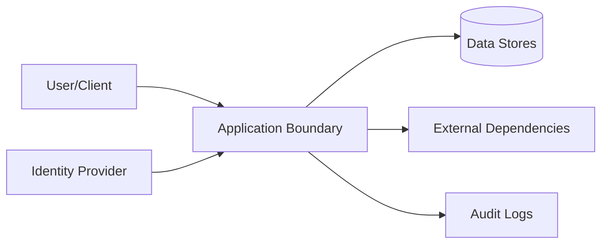

# Security

## Threat Model

```mermaid
flowchart LR
   U[User/Client] --> A[Application Boundary]
   A --> D[(Data Stores)]
   A --> X[External Dependencies]
   I[Identity Provider] --> A
   A --> L[Audit Logs]
```

## STRIDE Table
| Threat | Surface | Mitigation | Verification |
|---|---|---|---|
| Spoofing | Auth boundary | strong auth + token validation | auth tests |
| Tampering | State mutation APIs | integrity checks + RBAC | integration tests |
| Repudiation | Critical actions | immutable audit logs | log review |
| Information disclosure | Data at rest/in transit | encryption + classification | security scans |
| Denial of service | Hot paths | rate limit + backpressure | load tests |
| Elevation of privilege | Admin interfaces | least privilege + policy checks | authz tests |

## Authentication
- Identity source: human SSH access to servers (`kypris@paphos`,
  `nixos@oracle`) is public-key only. The authorized keys are each host's
  explicit keys plus `modules/_worldofgeese.keys`, a vendored copy of
  `https://github.com/worldofgeese.keys` that is reviewed in git. Servers never
  read GitHub when they evaluate keys, so a GitHub-side change cannot add
  access or break upgrades without a merged commit.
- Token/session lifetime:
- Rotation and revocation: change the key on GitHub, refresh the vendored file
  (the command is in `modules/_github-ssh-keys.nix`), merge, and upgrade the
  hosts. A key that is removed only on GitHub stays authorized until that
  refresh is merged and deployed. To revoke a compromised key, refresh and run
  `sudo systemctl start nixos-upgrade.service` on each host. Do not wait for
  the timer.

## Authorization
- Role model:
- Resource-level policy:
- Privilege escalation controls:

## Data Classification
| Data Class | Examples | Storage Rules | Access Rules |
|---|---|---|---|
| Public | docs, non-sensitive metadata | standard | unrestricted |
| Internal | operational telemetry | controlled | team access |
| Sensitive | tokens, PII, secrets | encrypted | least privilege |

## Sensitive Data Handling
- Encryption at rest:
- Encryption in transit:
- Redaction in logs:
- Retention + deletion policy:

## Supply Chain Security
- Recommended scanners: `npm audit`, `osv-scanner`, `snyk`
- Dependency update cadence:
- Signed artifact/provenance strategy:

## Secrets Management
| Secret | Source | Rotation | Consumer |
|---|---|---|---|
| `LEGO_GATEWAY_API_KEY` | `secretspec` provider, named (not stored) in `gateway.json` | provider-managed | every CLI coding agent, Emacs agent-shell, headroom |
| Every `secretspec.toml` secret (M-02877) | `secretspec.age`, age ciphertext committed to the repo, post-quantum (ML-KEM-768 + X25519) recipient | re-encrypted on every `secretspec set` | shell init, agents, `just cachix-push`, `hm-app-signing` |
| secretspec.age decryption key (M-02877) | Secure Enclave, post-quantum (mlkem768p256tag), access control `none`; handle in `~/.config/secretspec/se-identity.txt`, created by `just secretspec-se-setup` | new Mac: new key, then re-encrypt with the backup key | any process running as the user, on this Mac only |
| secretspec.age backup key | password manager only (`AGE-PLUGIN-PQ-1...`, mlkem768x25519) | manual: new key, then re-encrypt | `just secretspec-se-setup` on a new Mac |
| pr-reviewer GitHub token (M-02877) | `~/Library/Application Support/pr-reviewer/config.toml`, AES-GCM encrypted under a sibling 0600 keyfile plus a key derived from IOPlatformUUID and `$USER`; never in Nix | manual: `pr-reviewer config set-token` | `com.dktaohan.pr-reviewer` launchd agent; passed to git per-process via `GIT_CONFIG_*` env, never written to a clone's `.git/config` |
| pr-reviewer gateway virtual key (M-02877) | `~/Library/Application Support/pr-reviewer/gateway.key`, plaintext, 0600, FileVault at rest; a dedicated key so a locked keybag cannot block background reviews; never in Nix (the store holds only its path) | manual: replace the file | `com.dktaohan.pr-reviewer`'s claude harness, read per call by `apiKeyHelper` |
| Gateway key last-known-good cache (M-02877, any host using `gateway.keyCommand`) | `~/.local/state/gateway-key.cache`, plaintext, 0600, FileVault at rest; copy of `LEGO_GATEWAY_API_KEY` written by `gateway.keyCommand` after each successful secretspec lookup, so a locked keybag does not fail agents in flight; never in Nix | automatic: refreshed on the next unlocked lookup after the secret changes; delete the file to force a fresh lookup | `gateway.keyCommand` (pi, Caveman Code, omp, Claude Code shell token, Doom agent-shell), read only when secretspec misses |
| External service auth material | managed runtime configuration | periodic | runtime services |
| Artifact signing material | managed signing service/local secure store | periodic | release pipeline |

### Credential Handling Invariant
No plaintext secret value may enter a tracked file or the Nix store. Only the
*name* of a secret and a *command* that prints it may be declared; the value
exists solely in the environment of a process about to spend it.

Ciphertext is the one exception, and only when its decryption key never enters
the repo or the store: agenix files under `secrets/`, and `secretspec.age`.
The repo is public, so a committed ciphertext must be treated as already
harvested. For that reason `secretspec.age` uses a post-quantum recipient.
It is decrypted by a Secure Enclave key that cannot be exported, and has no
access control, so it never prompts. The accepted cost is that any process
running as the user on M-02877 can decrypt it. Off that machine only the backup
key, held in a password manager, can.

This forces a documented departure from vendor setup instructions. The gateway's
own docs configure Claude Code with `ANTHROPIC_AUTH_TOKEN=<credential>`, which
suits a human exporting into their own shell but would place the value in a
world-readable store path under `home.sessionVariables` or a shell profile. The
wrapper in `modules/agent-providers.nix` therefore runs the lookup at process
start instead. Shell init is not sufficient on mahakala: Home Manager does not
own the shell there (Guix Home does, and its `bashrc` returns early for
non-interactive shells), so an export would miss agents spawned by Emacs or a
timer.

Proof obligation: after any change to credential plumbing, grep the live secret
value against the built closure and confirm zero matches. Done for `b9d6b00`.
A prior violation of this invariant -- a `vk_...` key pasted into an untracked
`~/.cave/agent/models.json` -- is recorded as `home-manager-l23`; note that it
persisted precisely because the file was unmanaged, so no deploy could correct it.

## Security Testing
| Test Type | Cadence | Tooling |
|---|---|---|
| SAST | each PR | language linters/scanners |
| Dependency scan | each PR + weekly | supply-chain tools |
| DAST/pentest | scheduled | external/internal |

## Trust-Boundary Inventory
| Boundary | Principal/Input | Authority Granted | Validation | Audit Evidence | Failure Default |
|---|---|---|---|---|---|
| User/agent -> entrypoint | | | | | deny/reject |
| Entrypoint -> core | | | | | deny/reject |
| Core -> persistence | | | | | fail closed/transaction rollback |
| Runtime -> external dependency | | | | | timeout/degrade |
| paphos -> oracle (upgrade-state probe) | paphos' SSH host key (`modules/_host-keys.nix`), used by the root `paphos-oracle-relay-check` | `upgrade-status@oracle` can only run the forced command `systemctl is-failed nixos-upgrade.service` (`restrict`: no pty, no forwarding) | oracle's host key is pinned in paphos' `known_hosts`; `StrictHostKeyChecking=yes`, user known_hosts ignored | paphos journal for `paphos-oracle-relay-check`, Telegram alert | any other output alerts `oracle-nixos-upgrade-status-unavailable` |

## Agent and Automation Safety
- Prompt/configuration text is treated as untrusted input until evaluated by
  the repository's policy gate.
- Automation must not infer authorization, ownership, or a migration approval
  that is not present in the governed context.
- Sensitive artifacts, credentials, and untrusted attachments are not executed
  or imported as instructions.
- Every privileged mutation has an actor, scope, and durable evidence trail.

## Security Change Review
- [ ] New inputs and outputs are classified.
- [ ] Trust boundaries and privilege changes are documented.
- [ ] Abuse cases cover spoofing, tampering, disclosure, denial of service, and
  privilege escalation as applicable.
- [ ] Secret handling, redaction, retention, and deletion were re-checked.
- [ ] Supply-chain and provenance implications are recorded.

## Compliance and Audit
- Regulatory scope:
- Audit evidence location:
- Exception process:

## Pre-Promotion Security Checklist
- [ ] Threat model updated for changed surfaces.
- [ ] Auth/authz tests pass.
- [ ] Dependency vulnerability scan reviewed.
- [ ] No unresolved critical/high security findings.

## Strongest Security Primitives
Describe the security primitives and security controls implemented in this repository.

## Security Practices
- **Least Privilege**: Ensure minimal access permissions for all subsystems and roles.
- **Input Validation**: Strictly validate all inputs at trust boundaries.
- **Secure Storage**: Encrypt sensitive data at rest and in transit.

<!-- decapod:codebase-attestation:start -->

## Codebase Attestation

- Repository signal fingerprint: `0e05719cad3ab88e6d446097561a1ff22afe40a70b25362f791f6f983727d72e`
- Significant implementation surfaces: `.beads/` (1 files), `.github/` (1 files), `README.md/` (1 files), `docs/` (2 files), `terraform/` (1 files)
- Refreshed from the current codebase by `decapod specs.refresh`
<!-- decapod:codebase-attestation:end -->
